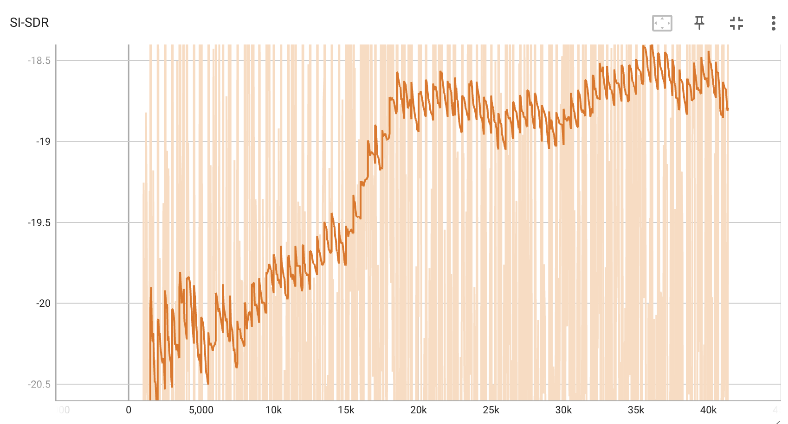

# Speaker Separation
Project on speaker separation within the project DL in Audio. This rep contains my implementation of VoiceFilter model and all the steps to reimplement the pipeline
## Model choice

For my implementation of VoiceFilter I used the model architecture which was presented within the paper [VoiceFilter: Targeted Voice Separation by Speaker-Conditioned Spectrogram Masking](https://arxiv.org/abs/1810.04826).


## Result

- Training took about 25 hours on one NVIDIA P100 GPU, yet could not reach the desired SI-SDR. Though the trend in metrics increase was very promising and the model definitely just needs more training time to hit good quality.

| Metrics             | Ours |
| ---------------------- | ----- |
| Median SI-SDR on LibriSpeech dev-clean     | 1.138 |
| Median PESQ on LibriSpeech dev-clean     |  1.22 |

### Dependencies

```
pip install -r requirements.txt
```

### Dataset Generation

As there are not prepared datasets for this kind of task, I had to create the datasets on my own. This dataset solution includes WHAM noises too, which will afterwards be used to generate mixes of audio with two speakers and additional noise.

Here is the pipeline how one could do it for future research.

```
conda install -c conda-forge sox
git clone https://github.com/JorisCos/LibriMix
cd LibriMix 
./generate_librimix.sh storage_dir
mv storage_dir ./your_main_repo
```
In generate_librimix.sh you should choose only 2 speakers for this exact task. 

After generating the dataset place utils/normalize-resample.sh to the head directory with all of your data to convert from .flac to .wav

```
vim normalize-resample.sh # set "N" as your CPU core number.
chmod a+x normalize-resample.sh
./normalize-resample.sh # this may take long
```

Then run in the Speaker_Separationg_VoiceFilter repo the following code

```
python3 generator.py -c config/data_convertion.yaml -d storage_dir/LibriSpeech -o wav_data -p 40 -n wav_data
```
This will output triplets of target.wav, ref.wav and mixed.wav which you will use for training


### Train VoiceFilter


1. Get pretrained model for speaker recognition system

    VoiceFilter utilizes speaker recognition system ([d-vector embeddings](https://google.github.io/speaker-id/publications/GE2E/)).

    This model was trained with [VoxCeleb2](http://www.robots.ox.ac.uk/~vgg/data/voxceleb/vox2.html) dataset,
    where utterances are randomly fit to time length [70, 90] frames.
    Tests are done with window 80 / hop 40 and have shown equal error rate about 1%.
    Data used for test were selected from first 8 speakers of [VoxCeleb1](http://www.robots.ox.ac.uk/~vgg/data/voxceleb/vox1.html) test dataset, where 10 utterances per each speakers are randomly selected.

    The model can be downloaded at [this GDrive link](https://drive.google.com/file/d/1YFmhmUok-W76JkrfA0fzQt3c-ZsfiwfL/view?usp=sharing).

## Very important, please do

```
wget --load-cookies /tmp/cookies.txt "https://docs.google.com/uc?export=download&confirm=$(wget --quiet --save-cookies /tmp/cookies.txt --keep-session-cookies --no-check-certificate 'https://docs.google.com/uc?export=download&id=1YFmhmUok-W76JkrfA0fzQt3c-ZsfiwfL' -O- | sed -rn 's/.*confirm=([0-9A-Za-z_]+).*/\1\n/p')&id=1YFmhmUok-W76JkrfA0fzQt3c-ZsfiwfL" -O embedder.pt && rm -rf /tmp/cookies.txt
```
```
mv ~/embedder.pt Speaker_Separationg_VoiceFilter/
```

2. Training process

     Specify your `train_dir`, `test_dir` at `config.yaml` and then run
    ```
    python trainer.py -c [config yaml] -e [path of embedder pt file] -m [name]
    ```

    In my case it was
    ```
    python3 trainer.py -c config/convert.yaml -e embedder.pt -m vf_exp3
    ```
    This will create `chkpt/name` and `logs/name` at base directory

3. View tensorboardX

    ```
    tensorboard --logdir ./logs
    ```
    
    My training loss for the final experiment:





4. Resuming from checkpoint

    ```
    python trainer.py -c [config yaml] --checkpoint_path [chkpt/name/chkpt_{step}.pt] -e [path of embedder pt file] -m name
    ```


## To evaluate my results do these steps


```
python3 inference.py -c config/convert.yaml -e embedder.pt --checkpoint_path model_best.pt -o results
```


## EVAL on custom test data

in -t parameter please set path to the root dir with all three dirs of data

```
python3 generate_for_test.py -t data -o res2 -c config/default_test.yaml

python3 inference.py -c config/inference_test.yaml -e embedder.pt --checkpoint_path model_best.pt -o results

```

## Bonus tasks

### Added SI-SDR Loss to VoiceFilter

[Look here](https://github.com/aizamaksutova/Speaker_Separationg_VoiceFilter/blob/main/utils/sisdr.py) and this metric was added to [evaluation stage](https://github.com/aizamaksutova/Speaker_Separationg_VoiceFilter/blob/main/utils/train.py)

### Validation results on WHAM tracks

| Metrics             | Ours |
| ---------------------- | ----- |
| Median SI-SDR on LibriSpeech dev-clean     | 0.648 |
| Median PESQ on LibriSpeech dev-clean     |  1.149 |


I generated a dataset of 1000 triplets from LibriSpeech dev_clean comparable to the one before but also adding noise to the mix data. In the updated [generator code](https://github.com/aizamaksutova/Speaker_Separationg_VoiceFilter/blob/main/generator_noisy.py) you can see where we add the noise to our mix data. Noise augmentations are taken from the WHAM dataset and randomly sampled to be added to different mixes. You can look up one of the output samples [here](https://drive.google.com/file/d/1119p7XIrZIfT26jKNxcFkv8UFra6mtxj/view?usp=sharing)

```
python3 generator_noisy.py -c config/noise_generation.yaml -d storage_dir/LibriSpeech -o noised_data -p 40 -n noised_data

#evaluation
python3 inference.py -c config/test_noise.yaml -e embedder.pt --checkpoint_path best_model.pt -o results
```

### Tried to use different encoders

I searched up different encoders for reference audios which we could use instead of the one we used in this model. 
I tried to implement a simple speaker embedder based on a ConvGRU model which is described in this [repo](https://github.com/RF5/simple-speaker-embedding), it didn't exactly work but you can see my implementation [here](https://github.com/aizamaksutova/Speaker_Separationg_VoiceFilter/blob/main/utils/train_new_emb.py)

## Logs 
To not make the readme to overflooded added all the logs to assests directory

